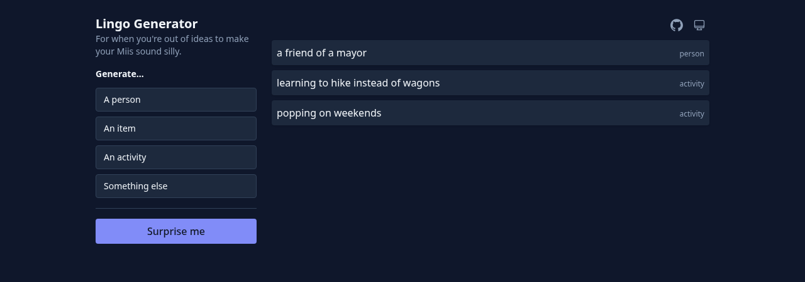

# Lingo Generator

A tiny single-page app that generates random "lingo" — short phrases in one of four categories — to feed into *Tomodachi Life: Living The Dream* conversation prompts.

Live site: http://axelv13.com/lingo-generator



## How it works

Each of the four category buttons in the sidebar generates one suggestion of that type. **Surprise me** generates a random suggestion from any category. Click a suggestion to copy it to the clipboard. History persists across reloads via `localStorage`; the first time you visit, the app seeds a few suggestions so you have something to look at.

The four categories match the game's prompts:

- **A person** — e.g. `Shaquille O'Neal`
- **An item** — e.g. `an impressive jackalope`
- **An activity** — e.g. `running with phoenixes`
- **Something else** — a grab-bag for anything that doesn't fit the other three

A theme toggle in the top-right cycles between **system**, **light**, and **dark**. System mode tracks your OS preference live.

## Development

Requirements: Node 20.10+.

```bash
git clone git@github.com:V13Axel/lingo-generator.git
cd lingo-generator
npm install
npm run dev          # start Vite dev server with HMR
npm test             # run unit + integration tests
npm run build        # produce docs/
npm run preview      # locally serve docs/ to verify the production build
```

## Deploying

The `docs/` directory is committed to the repo. GitHub Pages is configured to serve from `main` branch, `/docs` folder.

To publish a change:

1. `npm run build`
2. Commit source *and* the resulting `docs/` changes together.
3. `git push`

GitHub Pages redeploys automatically.

Note: the directory `docs/superpowers/` is gitignored planning material and lives alongside the build output. The `prebuild` script (`scripts/clean-docs.mjs`) removes only Vite-owned artifacts before each build, preserving `docs/superpowers/`.

## Adding content

- Word lists: `public/data/words/*.json` — flat arrays of strings.
- Templates:  `public/data/templates/*.json` — flat arrays of template strings.
- Irregular plurals, past-tense verbs, `-ing` forms, and `a/an` exceptions: `public/data/irregulars.json`.

Template placeholders use `{category}` or `{category:modifier}`. Supported modifiers:

- `:plural` on `noun`
- `:ing` and `:past` on `verb`

The special token `{a/an}` selects the correct article based on the word that follows it (after any nested template expansion). Any entry in a word list that itself contains `{...}` is recursively resolved — so `"{adjective} {noun}"` in `nouns.json` creates compound outputs.

Consonant doubling in `-ing` / past-tense forms is handled exclusively via `irregulars.ing` and `irregulars.past`. If you add a new verb whose default form is wrong (e.g. `begin` → `begining`), add it to `irregulars.ing` (`begin → beginning`) and `irregulars.past` (`begin → began` already there).

## License

Personal project. No license chosen yet.
</content>
</invoke>